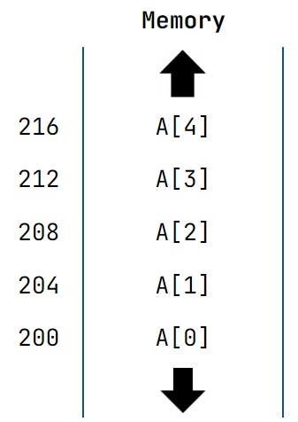

# INTRODUÇÃO A PONTEIROS EM C/C++
## O que são ponteiros?
Ponteiros são variáveis especiais que são utilizadas para armazenar endereços de memória.
## Sintaxe de ponteiros em C
### Como declarar ponteiros
```c
    int* p;
```
Declaramos o ponteiro `p` do tipo `int`.

Há outras maneiras de declarar ponteiros:

```c
    int *p;
    int * p2;
```
***
Observe o exemplo abaixo.
```c
    int* p1, p2;
```
Aqui declaramos o ponteiro `p1` e uma variável do tipo int normal `p2`.
***
## Atribuindo endereço ao um Ponteiro
Exemplo:
```c
    int* pc, c;
    c = 5;
    pc = &c; // &c = endereço da variável c
```
Aqui atribuimos o valor 5 à variável `c` e o endereço da variável `c` foi designado ao ponteiro `pc`.
***
## Acesse o valor da variável através de um ponteiro
Para acessar o valor da váriavel que um ponteiro aponta devemos usar o operador `*`. Por exemplo:
```c
    int* pc, c;
    c = 5;
    pc = &c;
    printf("%d", *pc);   // Output: 5
```
***
## Ponteiro de um ponteiro
É possível crair ponteiros que irão apontar para um endereço de outro ponteiro que por sua vez aponta para uma variável. Observe o exemplo abaixo.
```c
    #include<stdio.h>
int main()
{
    int x = 5;
    int* p = &x;
    *p = 6;
    int** q = &p; // int** q é uma forma de delcarar um variável que irá apontar para outro ponteiro
    int*** r = &q; // int*** r é um ponteiro que aponta pra outro ponteiro sucessivamente
    printf("%d\n",p); // output = -2136700228 (enderço da variável x)
    printf("%d\n",*p); // output = 6 (dereferencing p )
    printf("%d\n",*q); // output = -2136700228
    printf("%d\n",*(*q)); // output = 6
    printf("%d\n",*(*r)); // output = -2136700228
    printf("%d\n",*(*(*r))); // output = 6
    ***r = 10;
    printf("x = %d\n",x); // output = x = 10
    **q = *p + 2;
    printf("x = %d\n",x); // output = x = 12
    return 0;
}
```
***
## Void Pointer (ponteiro do tipo Void)
Um ponteiro do tipo void é um ponteiro que não tem um tipo de dado associado a ele. Um ponteiro do tipo void pode armazenar o endereço de qualquer tipo de variável (int, char, double...).
```c
    int a = 10;
    char b = 'x';
    
    void *p = &a;  // ponteiro void p pode aramazenar o endereço de int 'a'
    p = &b; // ponteiro void p pode aramazenar o endereço de char 'b'
```
OBS.: Ponteiros do tipo void não podem ser desreferenciados.
***
## Pointers e Arrrays
O array `int a[5]` será guardado na memória sequencialmente conforme a figura abaixo.
<p align="center">
  
</p>

Como os elementos estão alocados sequencialmente isso permite utilizar operações com ponteiros para acessar qualquer endereço na memory ou seu valor guardado por um array.

Exemplo 1:
```c
    int a[5] = {2, 4, 5, 6, 7};
    int *p;
    p = a;
    printf("%d\n", a); // output = 489110672 [endereço na memoria convertido para seu formato decimal]
    printf("%d\n", *a); // output = 2 [primeiro elemento do array]
```